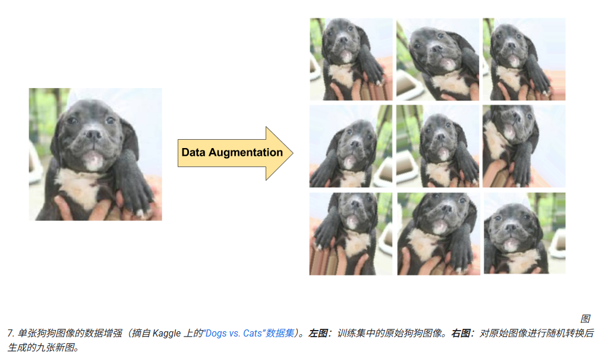

## 卷积神经网络简介

卷积神经网络(CNN) 可用于逐步提取越来越高级别的图像内容表示结果，这一发现标志着图像分类模型的构建取得了重大突破。CNN 不会通过预处理数据得出纹理和形状等特征，而是仅将图像的原始像素数据用作输入，然后“学习”如何提取这些特征，最终推断出这些特征构成的对象。

首先，CNN 会接收一个输入特征图：三维矩阵，其中前两个维度的大小分别与图像的长度和宽度（以像素为单位）对应。第三个维度的大小为 3（对应于彩色图像的 3 个通道：红色、绿色和蓝色）。CNN 包括多个模块，每个模块执行三个操作。

### 1. 卷积

卷积会提取输入特征图的图块，并向这些图块应用过滤器以计算新特征，生成输出特征图（也称为“卷积特征”  ，大小和深度可能与输入特征图的不同）  。卷积由以下两个参数定义：

- **所提取图块的大小** （通常为 3x3 或 5x5 像素）。
- **输出特征图的深度** ，对应于应用的过滤器数量。

在进行卷积期间，过滤器（大小与图块大小相同的矩阵）会有效地在输入特征图的网格上沿水平和垂直方向滑动，一次移动一个像素，从而提取每个对应的图块（参见图 3）。


*图 3. 在 5x5 输入特征图（深度为 1）上执行 3x3 卷积（深度也为 1）。在 5x5 特征图中，可以提取图块的 3x3 位置有 9 个，因此该卷积会生成一个 3x3 输出特征图。*

对于每个过滤器-图块对，CNN 会对过滤器矩阵和图块矩阵执行元素级乘法运算，然后对所得矩阵的所有元素求和，得出一个值。每个过滤器-图块对的每个结果值都会输出到卷积特征矩阵中。

在训练期间，CNN 会“学习”过滤器矩阵的最优值，以便能够从输入特征图中提取有意义的特征（纹理、边缘、形状）。随着应用于输入特征图的过滤器数量（输出特征图的深度）不断增加，CNN 可以提取的特征数量也会增加。但需要做出权衡的地方是，过滤器构成了 CNN 要使用的大部分资源，因此，添加的过滤器越多，训练时间越长。此外，添加到网络的每个过滤器带来的增量价值都比上一个过滤器少，因此，工程师希望构建这样一种网络：尽量使用最少的过滤器提取出正确分类图像所需的必要特征。

### 2. ReLU

每次执行卷积运算后，CNN 都会向卷积特征应用修正线性单元 (ReLU) 转换，以便将非线性规律引入模型中。ReLU 函数  F(x)=max(0,x) 会针对 *x* > 0 的所有值返回 *x* ，针对 *x* ≤ 0 的所有值返回 0。

### 3. 池化

ReLU 之后是池化步骤，即 CNN 会降低卷积特征的采样率（以节省处理时间），从而减少特征图的维数，同时仍保留最关键的特征信息。此过程常用的算法称为**最大池化**。

最大池化采用的运算方式与卷积的运算方式类似。我们在特征图上滑动并提取指定大小的图块。对于每个图块，最大值会输出到新的特征图，所有其他值都被舍弃。最大池化运算采用以下两个参数：

- 最大池化过滤器的 **大小** （通常为 2x2 像素）
- **Stride** ：各提取图块间隔的距离（以像素为单位）。最大池化与卷积不同：在执行卷积期间，过滤器在特征图上逐个像素滑动，而在最大池化过程中，步长会确定每个图块的提取位置。对于 2x2 过滤器，步长为 2 表示最大池化运算将从特征图中提取所有非重叠 2x2 图块（参见图 5）。


*图 5.* ***左图*** *：使用 2x2 过滤器和步长 2 在 4x4 特征图上执行最大池化运算。* ***右图*** *：最大池化运算的输出。请注意，此时生成的特征图为 2x2，仅保留了每个图块的最大值。*

### 全连接层

卷积神经网络的末端是一个或多个全连接层（当两个层“完全连接”时，第一层中的每个节点都与第二层中的每个节点相连）。全连接层的作用是根据卷积提取的特征进行分类。通常，最后的全连接层会包含一个 softmax 激活函数，该函数会针对模型尝试预测的每个分类标签输出一个概率值（范围为：0-1）。


# 防止过拟合

与所有机器学习模型一样，训练卷积神经网络时会遇到的一个关键问题是过拟合：模型紧密拟合训练数据的具体特征，以至于无法泛化到新样本。构建 CNN 时，您可以通过以下两种方法来防止出现过拟合：

- **数据增强**：通过随机转换现有图像生成一组新的图像，人为地增加训练样本的多样性和数量（参见图 7）。当原始训练数据集相对较小时，数据增强方法尤为有用。
- **dropout 正规化**：在一个训练梯度步长中随机地从神经网络中移除一些单元。



# 利用预训练模型

| 方法         | 训练内容                    | 优点               | 缺点               |
| ------------ | --------------------------- | ------------------ | ------------------ |
| **特征提取** | 只训练自己最后的分类层      | 快、不需要很多数据 | 特征固定、适应性差 |
| **微调**     | 训练分类层 + 解冻部分卷积层 | 精度高、适应性强   | 慢、容易过拟合     |

## **方式 1：特征提取（Feature Extraction）**

**你不训练 CNN 的卷积部分，只把它当作“特征提取器”。**

流程：

1. 你下载一个预训练模型（如 ResNet50、Inception、MobileNet）
2. 输入图片（例如蔬菜：胡萝卜、芹菜）
3. 获取这个模型“最后一层卷积层的输出”
4. 把它作为特征向量（feature vector）
5. 用这些特征训练你自己的分类器（如一个全连接层）

```
你的图片
   ↓
大模型的卷积部分（预训练）
   ↓  ← 抽取的特征（很有用）
你自己训练的小分类器（全连接层）
   ↓
预测结果
```

## **方式 2：微调（Fine-tuning）**

微调是在“特征提取”的基础上进一步：

**不仅训练最后的全连接层，还会微调上面的卷积层（通常是最后几层）**

流程：

1. 用预训练模型初始化参数（非常好的起点）
2. 解冻最后几层卷积层（让它们可训练）
3. 用你的小数据集继续训练
4. 能让模型适应你的任务特征

```
卷积层（预训练参数） ← 解冻部分，可以微调
       ↓
特征向量
       ↓
你自己的分类层（从头训练）
```


