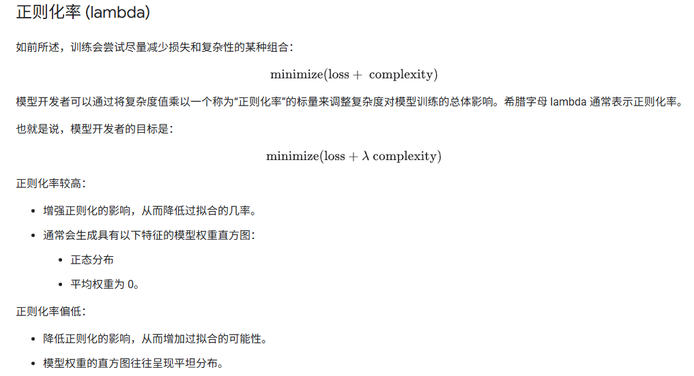
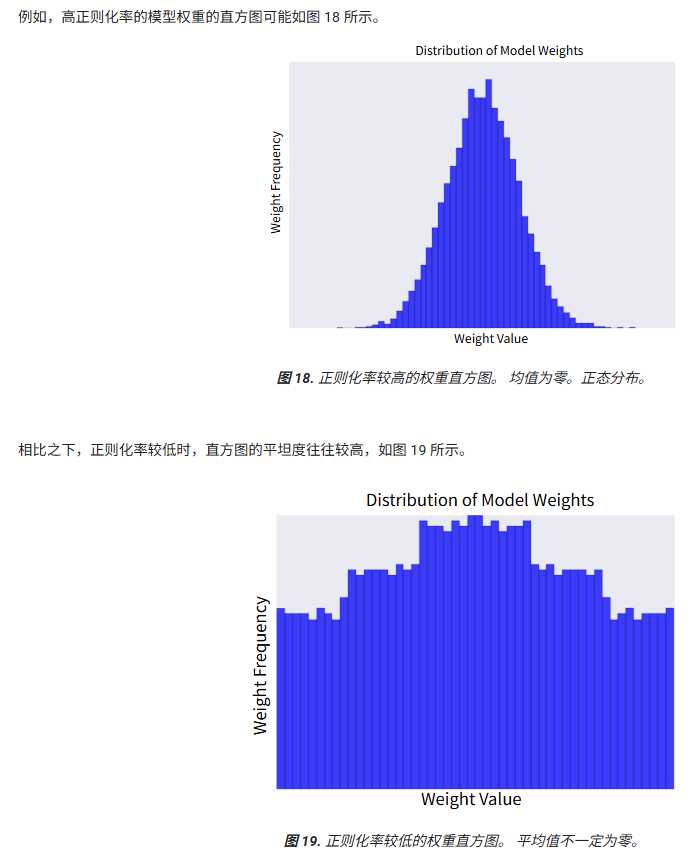
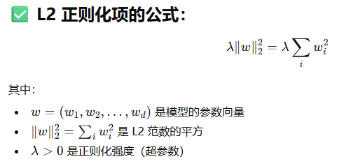
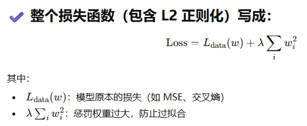
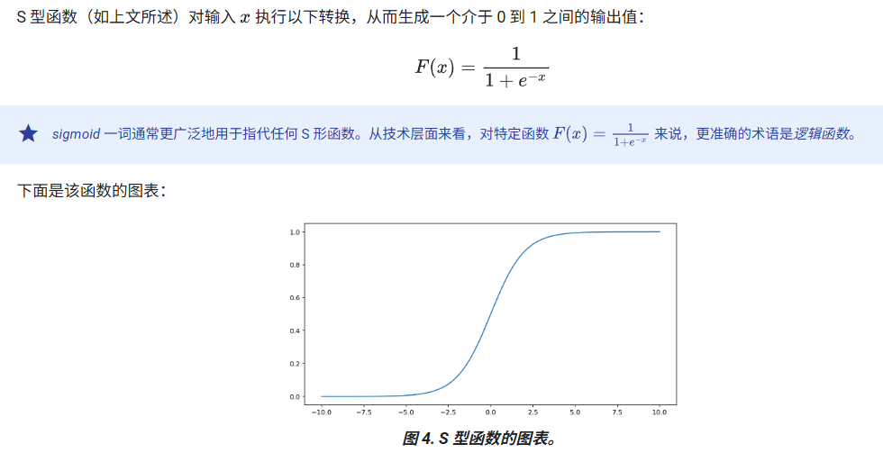
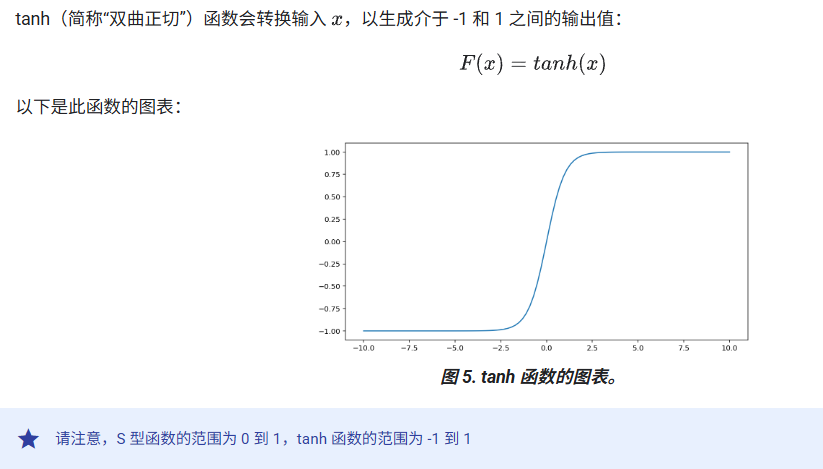
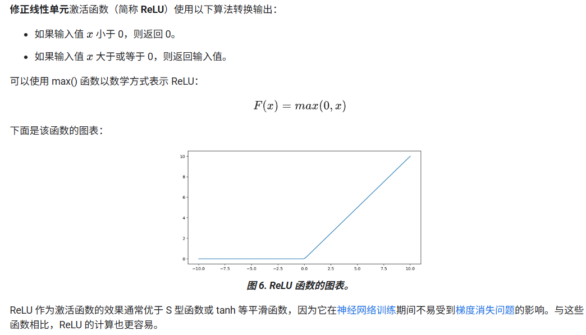
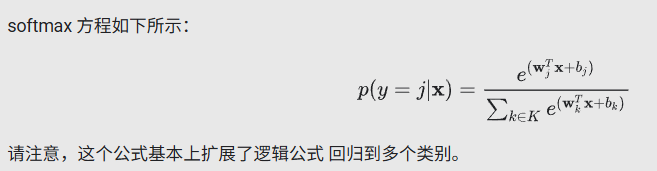

# 线性回归

## 线性回归的常见损失函数


## 凸函数


## 常见超参数


### **对于学习率大小的选择权衡**

- 如果学习速率过小，则可能需要过多的迭代次数才能实现收敛
- 过大的学习速率永远不会收敛，因为每次迭代都会导致损失在较大范围内波动或持续增加
- 理想的学习率有助于模型在合理的迭代次数内收敛

### **批次大小**

数据集包含数十万甚至数百万个示例，所以在更新模型的权重和偏差时，使用完整批次数据并不实际。以下两种常见技术可在不查看数据集中的每个示例的情况下，获得正确的*平均*梯度，然后更新权重和偏差：

- **随机梯度下降法 (SGD)**：随机梯度下降法在每次迭代中仅使用一个示例（批次大小为 1）。使用随机梯度下降可能会在整个损失曲线中产生噪声，而不仅仅是在接近收敛时。
- **小批次随机梯度下降法（小批次 SGD）**：小批次随机梯度下降法是全批次和 SGD 之间的折衷方案。确定每个批次的样本数量取决于数据集和可用的计算资源。


# 逻辑回归

## 逻辑函数


## 对数损失


## 逻辑回归中的正则化


### **为什么逻辑回归在大量特征且无正则化时，损失会趋近于 0？**

（1）逻辑回归的损失函数是负对数似然（NLL），对“正确且自信的预测”奖励过度，对“过度自信”没有惩罚。

（2）在高维特征空间中，数据更容易线性可分，一旦可分，模型可以无限增大权重的模长，使预测概率越来越接近 1 或 0。

（3）当权重持续变大时，正例的$W^Tx \to +\infty$，负例的$W^Tx \to -\infty$，从而使 NLL 中的 $−log⁡p$ 或 $−log⁡(1−p)$ 趋近于 0。

（4）因此，在无正则化的情况下，梯度下降不会停止，损失会持续下降，而参数的模长会无限发散。


# 分类

## 混淆矩阵


## 准确率、召回率、精确率和相关指标


## 接收器操作特征曲线 (ROC)和曲线下面积(AUC)


# 数据

## 处理数值数据

### 初始步骤

检查数据数据的两种方式：

- 在图表或图形中直观呈现数据。
- 获取有关数据的统计信息。

#### 统计数值数据

一般，使用pandas库的describe方法来显示统计指标，包括：

- `count` 是此列中填充元素的数量。理想情况下，每个列的 `count` 值都相同，但这并非总是如此。
- `mean` 是该列中值的传统平均值。我们建议将每个列的 `mean` 与中位数进行比较。**中位数**是表格的 50% 行。
- `std` 是此列中值的标准差。
- `min`、`25%`、`50%`、`75%` 和 `max` 表示 0、25、50、75 和 100 百分位数的值。

根据统计指标可以发现离群值：

1. **标准差（`std`）与平均值（`mean`）的比较：** 如果一个列的标准差非常大，甚至接近或超过其平均值，这表明数据分布非常分散，可能存在一些极端值（离群值）将数据向一侧拉伸。
2. 四分位数与最大值/最小值的比较：
   - **最大值（`max`）与 75% 分位数之间的巨大差异：** 这表示有少数值远大于数据集中绝大多数的其他值。例如，如果 75% 的数据都在某个相对较小的范围内，但最大值却异常庞大，这通常是离群值的迹象。
   - **最小值（`min`）与 25% 分位数之间的巨大差异（反向）：** 类似地，如果最小值远小于 25% 分位数，也可能存在异常小的离群值。

### 数值数据的标准化/归一化

#### 线性缩放


#### Z-score缩放


#### 对数缩放


一个直观的理解：取对数，可以把数值较小的范围的分布拉大，把数值较大的范围的分布拉小


#### 裁剪


#### 归一化总结


### 分箱


### 多项式转换


### 总结


## 处理分类数据

### 编码的概念

**编码**是指将分类数据或其他数据转换为**数值向量**可用于训练的模型。必须进行这种转换，因为模型仅使用浮点值进行训练；模型无法基于字符串进行训练， `"dog"` 或 `"maple"`。


**稀疏表示法：**如果某个特征的值主要为零（或为空），则该特征称为稀疏特征。许多分类特征（例如 `car_color`）往往是稀疏特征。稀疏表示形式为该特征的在向量里的索引，稀疏表示法占用的内存远少于八元素独热向量。重要的是，模型必须使用 one-hot 向量进行*训练*，而不是使用稀疏表示形式。**主要是存储的时候省内存！**


# 数据集、泛化和过拟合

## 类别不平衡的数据集

### 类平衡数据集与类不平衡数据集有何区别？

在类别平衡的数据集中，正类别和负类别的数量大致相等。例如，一个包含 235 个正类和 247 个负类的数据集就被认为是平衡数据集。相反，在类别不平衡的数据集中，一个标签比另一个标签常见得多。在现实世界中，类别不平衡的数据集远比类别平衡的数据集常见。例如，在信用卡交易数据集中，欺诈性购买行为可能仅占样本的不到 0.1%。同样，在医疗诊断数据集中，患有某种罕见病毒的患者数量可能不到总样本数的 0.01%。在类别不平衡的数据集中，较常见的标签称为**多数类**，而较不常见的标签称为**少数类**.

### 为什么训练不平衡的数据集很困难？

训练旨在创建一个能够成功区分正类别和负类别的模型。为了实现这一目标，批次（batches）需要包含足够数量的正类别和负类别样本。当数据集的类别严重不平衡时，即使是较大的批次也可能无法包含足够的少数类示例来支持适当的训练。例如，如果一个数据集包含 200 个多数类标签和 2 个少数类标签，当批次大小为 20 时，大多数批次将不包含任何少数类别的样本。即使批次大小为 100，每个批次平均也只包含一个少数类示例，这不足以进行适当的训练。这种极度不平衡的比例会导致模型无法正常训练。

### 如何克服训练不平衡数据集的问题？


## 过拟合

### 什么会导致过拟合？

一般来说，过拟合是由以下一种或两种问题导致的：

- 训练集不能充分代表真实数据（或验证集或测试集）。
- 模型过于复杂。

## 模型复杂性

机器学习模型必须同时满足两个相互冲突的目标：

- 能很好地拟合数据。
- 尽可能简单地拟合数据。

为了让模型保持简单，一种方法是惩罚复杂的模型；也就是说，在训练过程中强制模型变得更简单。对复杂模型进行惩罚是一种**正则化**。


## 正则化





### 在学习率和正则化率之间寻找平衡点

#### 



#### 权重更新公式

$$
w←w−η(∇L(w)+λw)
$$


- **学习率 η 想把权重推大**（往损失下降方向走）
- **正则化 λ 想把权重拉回零**（防止过拟合）

二者力量对抗：

| η 大 & λ 小 | 权重大，容易过拟合 |
 | η 小 & λ 大 | 权重小，容易欠拟合 |

你的任务就是找到一个**ηλ 的合适平衡**。

而且：

> 一旦改变学习率 η，正则化力度 ηλ 全变了 → 必须重调 λ
>  一旦改变 λ，正则化效果又变了 → 必须重调 η

所以这两个超参数必须一起调。


# 高级机器学习模型

## 神经网络

### 激活函数


$$
\tanh(x) = \frac{e^{x} - e^{-x}}{e^{x} + e^{-x}}
$$




### 神经网络训练的最佳实践

| **问题类型**                       | **哪个梯度出了问题？（具体说明）**                           | **梯度表现**                 | **产生原因（几句话版）**                                     | **后果**                                   |
| ---------------------------------- | ------------------------------------------------------------ | ---------------------------- | ------------------------------------------------------------ | ------------------------------------------ |
| **梯度消失（Vanishing Gradient）** | **靠近输入层的梯度**：$\frac{\partial L}{\partial W^{(1)}}、\frac{\partial L}{\partial h^{(1)}}$ 会趋近 0 | $\to 0$                      | 深度网络中，反向传播的链式乘法包含许多小于 1 的导数（尤其是 sigmoid / tanh）→ 多次相乘后指数级衰减 | 低层几乎不更新，模型训练极慢或停滞         |
| **梯度爆炸（Exploding Gradient）** | **靠近输入层的梯度**：$\frac{\partial L}{\partial W^{(1)}}、\frac{\partial L}{\partial h^{(1)}}$ 会变得极大 | $\to \infty$                 | 权重矩阵过大，反向传播链式乘法包含多个 (>1) 的项 → 多次相乘后指数级爆炸 | 参数更新幅度过大，训练发散，损失跳动       |
| **ReLU 死亡（Dead ReLU）**         | **某些神经元的局部梯度**：ReLU 对应的 $\frac{\partial L}{\partial z^{(l)}})$永远等于 0 | 永远为 0（单个神经元层局部） | 某神经元的输入长期落在负半区（(z<0)），ReLU 导数为 0，使得对应的梯度始终为 0 | 该神经元永不更新，完全失效（对模型无贡献） |

| 激活函数    | 原函数 (f(x))                                          | 导数 (f'(x))                                      | 导数最大值 | 为什么会（或不会）导致梯度消失                               |
| ----------- | ------------------------------------------------------ | ------------------------------------------------- | ---------- | ------------------------------------------------------------ |
| **Sigmoid** | $\displaystyle \sigma(x)=\frac{1}{1+e^{-x}}$           | $\displaystyle \sigma'(x)=\sigma(x)(1-\sigma(x))$ | **0.25**   | 最大导数只有 0.25，且大多数区域导数接近 0 → 多层连乘后迅速趋零 |
| **tanh**    | $\displaystyle \tanh(x)=\frac{e^x-e^{-x}}{e^x+e^{-x}}$ | $\displaystyle \tanh'(x)=1-\tanh^2(x)$            | **1**      | 只有在 x≈0 时导数≈1，其他区域导数接近 0 → 多层连乘后趋零，仍会梯度消失 |
| **ReLU**    | $\displaystyle f(x)=\max(0,x)$                         | $f′(x)=1(x>0), 0(x<0)$                            | **1**      | 在正区间导数恒为 1，不会衰减 → 深层网络中梯度不会因连乘而变小（避免梯度消失） |

有一种正则化形式，称为**Dropout 正则化**，对神经网络很有用。其工作原理是，在一个梯度步长中随机“丢弃”网络中的单元激活。丢弃的样本越多，正则化效果就越强：

- 0.0 = 不进行 dropout 正规化。
- 1.0 = 舍弃所有节点。模型学不到任何规律。
- 0.0 和 1.0 之间的值更有用。



### 分类问题的激活函数选择

| 项目             | One-vs-All（多个 sigmoid）                                   | Softmax（多类互斥）                                          |
| ---------------- | ------------------------------------------------------------ | ------------------------------------------------------------ |
| 输出形式         | 每个类别一个 sigmoid：$p_k = \sigma(z_k)$，彼此独立          | 所有类别共用一个 softmax：$p_k = \frac{e^{z_k}}{\sum_j e^{z_j}}$ |
| 概率约束         | 各类别概率**没有**和为 1 的约束，可以都高或都低              | 所有类别概率**必须相加为 1**，是一个分布                     |
| 类别关系         | 类别可以**同时为真**，不互斥                                 | 类别被视为**互斥**，只能“偏向一个”                           |
| 是否支持多标签   | ✅ 支持：同一样本可以属于多个类别（如同时是 labrador 和 poodle） | ❌ 不支持：同一样本只能属于一个类别                           |
| 典型损失函数     | 对每个类别做二分类交叉熵（Binary Cross Entropy）并求和       | 多类交叉熵（Categorical Cross Entropy）                      |
| 输出结果如何解读 | 每个类别是一个“是否属于该类”的独立概率                       | 在所有类别中“选一个”最可能的类别                             |
| 适合的应用类型   | **多标签分类（multi-label）**：图像中多个物体、多种情感、多标签文本分类、混血狗品种识别等 | **单标签分类（multi-class）**：手写数字识别（0–9）、单一品种分类、单一 |


## Embeddings

嵌入的本质是：**把离散数据（文本、词语、字符、图像、SSID 等）变成连续的稠密向量。**

#### 嵌入方法总结

| 方法类别                     | 代表技术 / 模型                   | 工作方式                                | 特点                   | 优点                                 | 缺点                           | 常见应用                           |
| ---------------------------- | --------------------------------- | --------------------------------------- | ---------------------- | ------------------------------------ | ------------------------------ | ---------------------------------- |
| **降维方法**                 | PCA、SVD、LSA                     | 对高维特征做数学降维                    | **静态**、线性或非线性 | 简单、快速、可解释性强               | 无语义理解能力、无法处理多义词 | 早期 NLP、主题分析                 |
| **静态词嵌入**               | Word2Vec、GloVe、fastText         | 训练词共现关系，学习词 → 向量的固定映射 | **静态**、每词一个向量 | 轻量、语义结构好、易用               | 无上下文、无法处理多义词       | 文本相似度、分类、推荐             |
| **任务相关嵌入（神经网络）** | Embedding 层、Siamese、Bi-encoder | 在某具体任务训练中学习特定向量表示      | 与任务强相关           | 可高度优化目标任务                   | 需要任务数据，泛化有限         | 推荐系统、检索、匹配系统           |
| **上下文嵌入**               | ELMo、BERT、GPT 等 Transformer    | 根据上下文动态生成表示                  | **动态**、语境敏感     | 表达能力最强，可处理多义词、深度语义 | 模型大、计算开销大             | 现代 NLP（摘要、分类、对话、检索） |

#### 静态嵌入 vs 上下文嵌入

| 对比维度             | 静态嵌入（Static Embedding） | 上下文嵌入（Contextual Embedding） |
| -------------------- | ---------------------------- | ---------------------------------- |
| 向量是否随上下文变化 | ❌ 不变（固定向量）           | ✅ 会变（动态向量）                 |
| 能否处理多义词       | ❌ 不行                       | ✅ 强项                             |
| 对语境的敏感性       | ❌ 不敏感                     | ✅ 高度敏感                         |
| 表达能力             | 中等（词级语义）             | 强（句法 + 语义 + 上下文）         |
| 数据依赖             | 中等                         | 需要大量训练数据                   |
| 模型复杂度           | 低                           | 高（Transformer）                  |
| 推理成本             | 快                           | 慢                                 |
| 适合任务             | 粗粒度语义、资源受限任务     | 深度语义理解、现代 NLP 主流        |
| 示例工具             | Word2Vec, GloVe              | ELMo, BERT, GPT                    |


## 大语言模型

### 语言模型

语言模型的核心目标，是**根据已有上下文预测下一个 token 或一个 token 序列出现的概率**。token 可以是一个词、子词、甚至单个字符。通过这种“预测缺失内容”的能力，语言模型不仅能完成句子补全，还能进一步扩展到文本生成、翻译、摘要等复杂任务。

------

#### 一、语言模型的核心任务

语言模型本质上学习的是一个概率分布：

$P(下一个 token∣前面所有 token)$

换句话说，它根据已经出现的上下文，估计最可能继续出现的内容。例如，在句子：

```
When I hear rain on my roof, I ______ in my kitchen.
```

模型会给各种可能的补全打分，如 cook soup、warm up a kettle、relax 等。
 这类“预测下一个 token”的行为，是现代 NLP 各类能力的基础。

------

#### 二、N-gram 语言模型（传统方法）

N-gram 是由连续 N 个词组成的固定窗口。例如：

- 2-gram：bigram
- 3-gram：trigram
- 5-gram：5-gram

通过统计训练语料中各种 N-gram 出现的频率，模型可以根据前 N−1 个词预测第 N 个词。

**优点：**

- 简单易实现
- 训练和推理速度快

**缺点：**

- **上下文极短**（只有 N−1 个词）
- **稀疏性严重**：N 越大，出现次数越少
- 无法建模长距离依赖（例如对整段、整句情绪或语义的判断）

因此，N-gram 模型在多义词消歧、复杂语义推断等任务中表现有限。

------

#### 三、RNN：对上下文的进一步扩展

为了克服 N-gram 上下文不足的问题，Recurrent Neural Networks（循环神经网络）被提出用于语言建模。RNN 会逐 token 读取序列，并通过隐藏状态将前面的信息累积下来，从而实现比 N-gram 更长的上下文建模。

**RNN 的改进点：**

- 能学习跨多个词甚至多句子的语境
- 能捕捉顺序关系

**局限性：**

- token 逐次处理，不能并行化
- 随着序列变长，信息逐渐被遗忘
- 遇到“梯度消失”时会难以捕获长距离依赖

尽管 RNN 比 N-gram 大幅进步，但其可利用的上下文窗口仍然有限。

------

#### 四、为什么长上下文如此重要？

语言的含义常常依赖于句子、段落，甚至整篇文档的语境。短上下文模型（如 N-gram）往往无法正确区分多义词或理解长距离信息。例如，“orange”究竟是颜色还是水果，如果没有更广泛的句子背景，模型往往无法正确判断。

人类能在 Act 3 记住 Act 1 的设定，同样地，强大的语言模型也需要在预测中使用更长的上下文。

------

#### 五、现代大型语言模型（LLM）的突破点

Transformer 架构及其核心机制 **self-attention**，彻底解决了 RNN 的上下文限制：

- 能一次性读取整个序列（全局上下文）
- 能灵活选择关注哪些词
- 能同时建模长距离依赖和细粒度语义关系

因此，现代 LLM 不再受到“只看局部窗口”或“梯度消失”的限制，能够在大规模数据上学习丰富的语言规律，并在多种任务中表现出色。


### 大语言模型（LLM）

#### Transformer 的构成与工作机制

##### • Encoder–Decoder 架构

- **Encoder**：把输入文本 (source) 转成一个中间表示 (intermediate representation)；
- **Decoder**：把中间表示转成输出文本 (target)，适用于机器翻译、生成式任务等。
- 並非所有 Transformer 都是完整 encoder‑decoder；也有 **encoder-only**（用于文本理解／embedding） 或 **decoder-only**（用于生成／续写）的变种。

##### • Self-Attention (自注意力)

- 核心思想：对输入序列中每个 token，模型会 **为它与序列中所有其他 token 计算“相关性 (relevance)”**，从而决定每个 token 对当前 token 的影响程度。
- 举例：一句话里有 “it” 这种代词，self‑attention 会帮助模型判断 “it” 指的是哪个名词（谁与“it”关系最大），通过给那些候选名词较高权重。
- 这种机制让模型能更好地捕捉语义关系与上下文依赖 — 比传统只看固定小窗口 (如 N‑gram) 或串行处理 (如 RNN) 强得多。

##### • Multi‑Head + Multi‑Layer Attention

- 一个 attention 层通常包含多个注意力头 (multi‑head)；每个头因为参数不同，可以学习不同类型的关系 — 如语法、指代、语义、结构等。最终将它们的结果整合。
- 多个 such 层 (multi-layer) 堆叠起来。前几层可能捕捉基础结构 (如语法、短距离依赖)，而更深层则能整合这些信息，用于捕捉更抽象、更高层次的语义、上下文、篇章结构。

------

#### LLM 的训练 & 推理机制

- LLM 的训练通常采用 **无监督学习 (self‑supervised learning)**：通过大量未经标注的文本和 **masked-prediction (掩码预测)** 任务，让模型学习语言统计规律 + 语义结构。
- 也就是说：把句子中若干 token 隐藏 (mask)，然后训练模型预测被隐藏的 token。经过海量这样训练，模型会学到句法、语义、常识、上下文依赖等语言结构。
- 虽然 LLM 看上去像是“理解”语言、做推理、写文章，但其本质仍类似“超级强大 autocomplete (补全)”机制：它通过统计 + 上下文 + 参数，在给定 prompt 后预测最可能的补全。

------

#### 优势 & 局限 / 挑战

##### ✅ 优势

- 能处理长上下文、复杂依赖 (long-range dependencies)
- 生成语言自然、连贯、语义丰富 — 可用于翻译、摘要、对话、代码生成等多种任务 
- 同一个模型可以通过不同方式 (fine-tune, prompt, instruction‑tune) 应对多种任务

##### ⚠️ 局限 / 风险

- **计算 / 资源消耗大**：模型参数多、context 长、注意力头多，推理和训练都需要大量算力和内存。模型越大，资源消耗越高。
- **可能产生“幻觉 (hallucination)”**：模型生成内容可能不真实、不准确。
- **偏见 / 偏差 /偏见问题 (bias)**：由于训练数据是现实世界的大量文本，模型可能学到偏见、刻板印象、不公正的关联。
- 

#### LLM Tuning - 微调、蒸馏与提示工程

##### 1. 微调 (Fine-tuning)
- **目标**：将预训练的大型 LLM 微调到特定任务（分类、回归等）。
- **方法**：在任务特定的数据集上继续训练，更新部分或全部参数。
- **优点**：任务适应性强，性能提升显著。
- **缺点**：计算成本高，模型参数依然庞大。

##### 2. 蒸馏 (Distillation)
- **目标**：从大型模型中生成一个更小、更高效的学生模型。
- **方法**：使用大模型生成标签，通过训练小模型学习大模型的预测。
- **优点**：推理效率高，节省计算资源。
- **缺点**：小模型的性能较大模型有所下降。

##### 3. 提示工程 (Prompt Engineering)
- **目标**：通过设计合适的输入提示，引导预训练模型进行特定任务，而无需修改模型参数。
- **方法**：使用 one-shot、few-shot 或 zero-shot 提示来引导模型。
- **优点**：无需训练，快速应用。
- **缺点**：难以应对复杂任务，效果不稳定。

##### 4. 离线推理 (Offline Inference)
- **目标**：将计算密集型的 LLM 推理预先完成并缓存，减少实时推理负担。
- **方法**：批量推理并存储结果，在应用中直接读取。
- **优点**：节省资源，提升响应速度。
- **缺点**：适用于特定任务，实时性要求低。


