# 适合决策森林的数据


# 决策树

## 适用于包含数值特征的二元分类的精确分屏器

### 香农熵

​	越混乱熵越大，越纯熵越小。

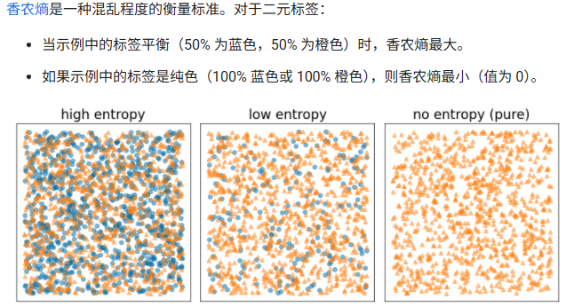

#### 熵是怎么定义的？

先定义两个辅助量：

1. **正例比例 $R(X)$**
    对任意一个样本集合 $X$：
   $$
   R(X) = \frac{\text{X 中正例的个数}}{\text{X 的总个数}} = \frac{\lvert\{x \in X : x = pos\}\rvert}{\lvert X \rvert}
   $$
   

   - 这里 `pos` 是你选定的“正类标签”（比如蓝色）。
   - 注意：**选哪个当正类不影响熵值**，因为只是 p 和 1−p 的互换。

2. **熵 $H(X)$**
    对一个二元标签集合 $X$，熵定义为：
   $$
   H(X) = -p \log p - (1-p)\log(1-p), \quad p = R(X)
   $$
   

   - 如果 $p=0.5$（一半一半），熵最大，最混乱。
   - 如果 $p=0$ 或 $p=1$（全是同一类），熵为 0，完全纯。

### 信息增益

信息增益就是“切前熵 − 切后加权熵”，也就是**熵降低了多少**。**原来这堆样本有多乱** − **按占比看，分成两堆之后平均有多乱**。分得越“纯”，第二项越小，差值越大，你的这个分裂条件就越好。

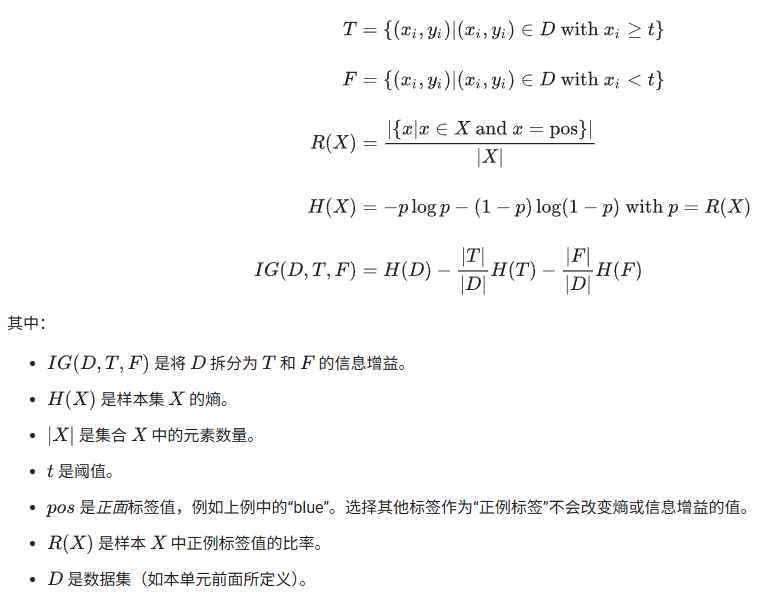

### 候选阈值怎么选？——排序 + 取中点

步骤：

1. **对该特征的所有取值排序**：
    得到 $x_s(1) \le x_s(2) \le \dots \le x_s(n)$。

2. **候选阈值只看“相邻点的中点”**：
    对每一对相邻值 $x_s(i), x_s(i+1)$，构造一个候选阈值：
   $$
   t_i = \frac{x_s(i) + x_s(i+1)}{2},\quad i=1,\dots,n-1
   $$
   

   - 这样保证阈值在两个不同样本之间。
   - 当你用 $x < t_i$ vs $x \ge t_i$ 切数据时：
     - 左边刚好是前 $i$ 个样本
     - 右边是后面 $n-i$ 个样本
   - 如果你选任何在这两个值之间的别的实数，划分结果是一样的，没必要重复测。

3. 对每个候选阈值 $t_i$，计算一次信息增益 $IG(D,T,F)$，选最大的那个。

### 过拟合和剪枝

#### 过拟合：学习到噪声

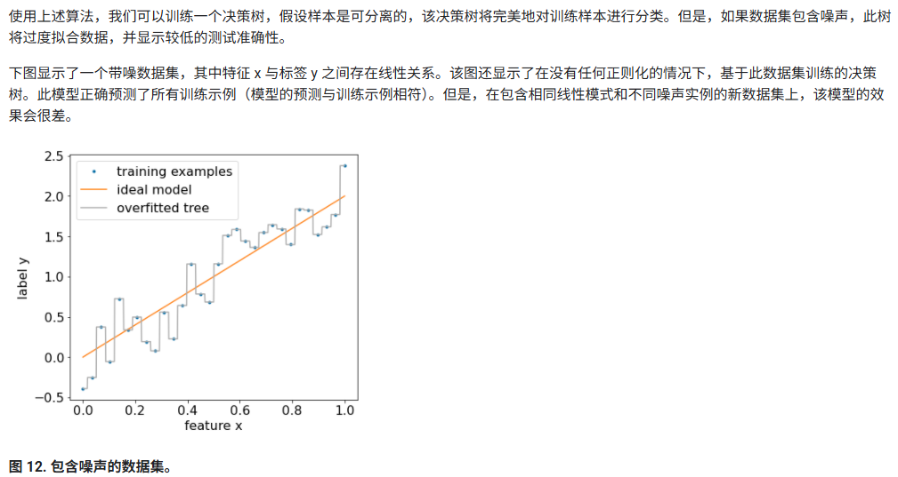

#### 正则化方法

- **设置深度上限**：防止决策树的深度超过上限（例如 10）。
- **设置叶子中的示例数下限**：如果叶子中的示例数少于特定数量，则不会考虑对其进行拆分。
- **剪枝**：在训练后通过选择性地移除（修剪）某些分支（即将某些非叶节点转换为叶节点）来进行正则化。选择要移除的分支的常见解决方案是使用验证数据集。也就是说，如果移除某个分支可以提高验证数据集上的模型质量，则系统会移除该分支。

## 决策树特征重要性

&gt; 一句话：  
&gt; **先让树长完，再开“评功会”——谁用得狠、谁缺了掉分，谁就是大佬。**

---

### 三种主流算法

| 类型                                | 何时算                                                   | 用到了什么                               |
| ----------------------------------- | -------------------------------------------------------- | ---------------------------------------- |
| **内置重要性**（Gini/信息增益总和） | 在每次分裂时就把“增益”累加到对应特征上；树完事直接读表   | 训练过程本身的数据，**几乎零额外成本**   |
| **节点计数法**                      | 树建完后扫一遍所有节点，统计每个特征出现次数             | 只需树结构，不需数据                     |
| **排列重要性**（permutation）       | 树建完 **且** 要有验证集；把某一列随机打乱再测准确率下降 | 需要 **模型 + 数据 + 标签** 重新推理一次 |

---

### 内置 vs 排列 

- **内置高 + 排列高** → 真·核心特征  
- **内置高 + 排列低** → 龙套/过拟合嫌疑（如样本 ID）  
- **内置低 + 排列高** → 幕后 Boss，用得少但离不开  
- **都低** → 删了省事

---

### 排列重要性

```python
from sklearn.inspection import permutation_importance
model.fit(X_train, y_train)          # 1. 树已定型
perm = permutation_importance(
        model, X_val, y_val,         # 2. 用验证集
        n_repeats=10, random_state=42)
importance = perm.importances_mean   # 3. 取平均下降
```


# 决策森林

决策森林是**由多棵决策树组成的通用模型族**。
训练完成后，对新样本的预测 = **各棵树输出的汇总**；汇总方式由具体算法决定。

| 算法               | 任务类型 | 单树输出      | 汇总规则     | 数学形式                    |
| ------------------ | -------- | ------------- | ------------ | --------------------------- |
| **随机森林 RF**    | 多类分类 | 类别投票      | 多数表决     | $ŷ = argmaxₖ Σᵢ 𝟙[Tᵢ(x)=k]$ |
| **梯度提升树 GBT** | 二分类   | logit（浮点） | 累加后再激活 | $z = Σᵢ Tᵢ(x)  ŷ = σ(z)$    |

σ(·) 通常为 Sigmoid 函数，可将累加 logit 转换为概率。

# 随机森林

**随机森林** (**RF**) 是决策树的集合，其中每个决策树都使用特定的随机噪声进行训练。随机森林是最常见的决策树集成形式。本单元介绍了几种用于创建独立决策树的技术，以提高构建有效随机森林的几率。

## 打包 Bagging

**Bagging**（**b**ootstrap **agg**regat**ing**）是指对训练集中的随机样本子集训练每个决策树。换句话说，随机森林中的每个决策树都是基于*不同的子集*进行训练的。

打包很奇怪。每个决策树都使用与原始训练集中相同的*示例数量*进行训练。例如，如果原始训练集包含 60 个示例，则每个决策树都将使用 60 个示例进行训练。不过，抽样平均法仅针对这些示例的*子集*（通常为 67%）训练每个决策树。因此，在训练给定决策树时，必须*重复使用*该子集中的 40 个示例中的某些示例。这种重复使用称为“有替换项”训练。

## 特征抽样

**属性抽样**是指，在每个节点上，系统只会测试一部分随机特征，而不是在所有可用特征中寻找最佳条件。在决策树的每个节点中，系统都会随机抽取一组测试特征。

相当于在每个节点上，在一部分随机特征里寻找最佳条件。

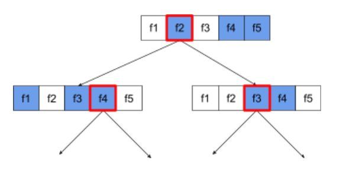

## 停用决策树正则化

随机森林中的各个决策树在训练时不会进行修剪。这会生成过于复杂且预测质量较差的树。系统会对树进行组合，而不是对单个树进行正则化，从而获得更准确的整体预测结果。

**注意** ：通常，大幅降低单个决策树的方差（例如，通过限制其深度）会提高单个决策。

我们*预计*随机森林的训练和测试准确性会有所不同。随机森林的训练准确性通常要高得多（有时等于 100%）。不过，随机森林的训练准确率非常高是正常现象，并不表示随机森林过度拟合。

这两个随机来源（抽样和属性抽样）可确保决策树之间相对独立。这种独立性可以修正各个决策树的过拟合。因此，该模型集成不会过度拟合。我们将在下一部分中说明这种不直观的影响。

*纯*随机森林在训练时不设置每个叶子的最大深度或最小观察次数。在实践中，限制每个叶子的最大深度和最小观察次数是有益的。默认情况下，许多随机森林都使用以下默认设置：

- 深度上限约为 16
- 每个叶节点的最小观察次数约为 5。

您可以调整这些超参数。

## 可视化总结

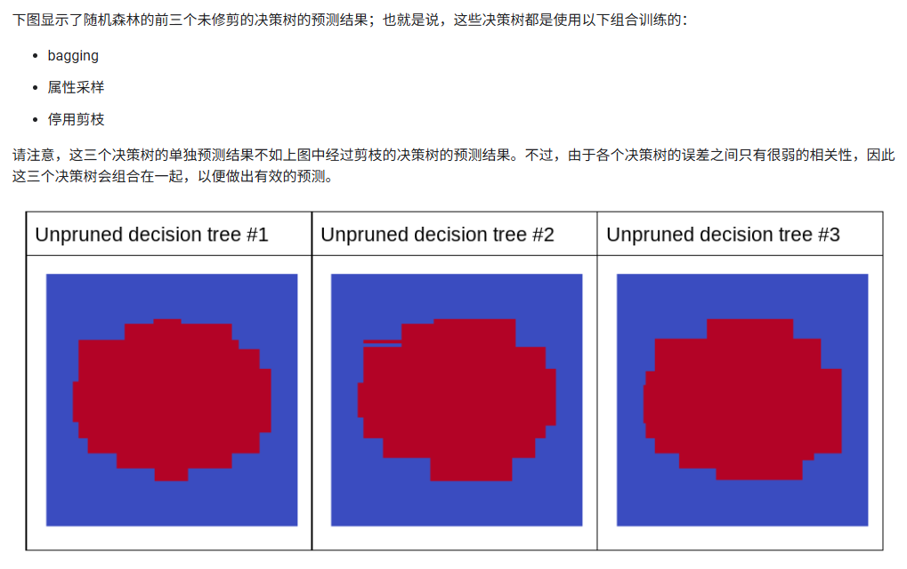

## 随机森林里树的数量

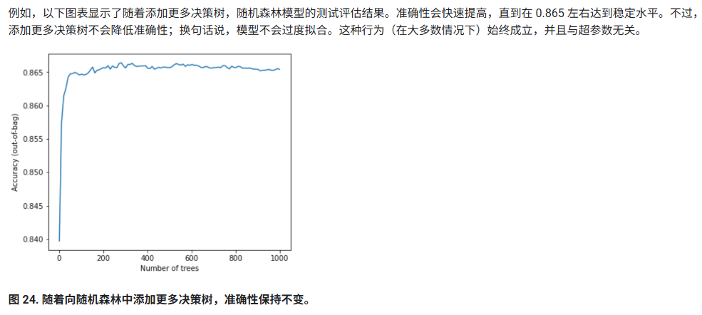

## 随机森林的袋外评估（OOB Evaluation）

随机森林由很多棵树组成，每一棵树的训练数据都来自原始训练集的 **自助采样（bootstrap sampling）**：

- 每棵树都会从训练集随机有放回采样 67% 左右的数据。
- 剩下大约 33% 的数据 **这棵树没有见过**，称为其 **袋外数据（out-of-bag samples）**。

**OOB 评估的思想：**

> 每个训练样本都可以由“没有见过它的那些树”给出预测，这个预测可以被视为“交叉验证结果”。

因此：

- **不需要额外的验证集**
- **不需要 K 折交叉验证**
- 训练时就能得到模型的泛化误差估计

## 随机森林的优缺点

**优点：**

- 与决策树一样，随机森林支持原生数值特征和分类特征，通常不需要特征预处理。
- 由于决策树是独立的，因此可以并行训练随机森林。因此，您可以快速训练随机森林。
- 随机森林具有默认参数，通常可提供出色的结果。调整这些参数通常对模型没有太大影响。

**缺点：**

- 由于决策树不会被修剪，因此它们可能很大。节点数超过 100 万的模型很常见。随机森林的大小（以及推理速度）有时会成为问题。
- 随机森林无法学习和重复使用内部表示法。每个决策树（以及每个决策树的每个分支）都必须重新学习数据集模式。在某些数据集中（尤其是非表格数据集，例如图片、文本），这会导致随机森林的结果不如其他方法。

# 梯度提升决策树

**梯度提升（gradient boosting）**涉及两种类型的模型：

- “弱”机器学习模型，通常是决策树。
- 由多个弱模型组成的“强”机器学习模型。

## 迭代过程

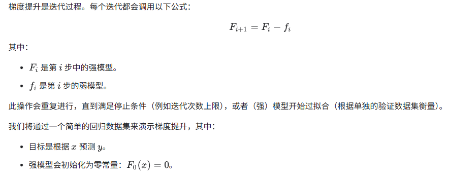

```
# Simplified example of regressive gradient boosting.

y = ... # the labels
x = ... # the features

strong_model = []
strong_predictions = np.zeros_like(y) # Initially, the strong model is empty.

for i in range(num_iters):

    # Error of the strong model
    error = strong_predictions - y

    # The weak model is a decision tree (see CART chapter)
    # without pruning and a maximum depth of 3.
    weak_model = tfdf.keras.CartModel(
        task=tfdf.keras.Task.REGRESSION,
        validation_ratio=0.0,
        max_depth=3)
    weak_model.fit(x=x, y=error)

    strong_model.append(weak_model)

    weak_predictions = weak_model.predict(x)[:,0]

    strong_predictions -= weak_predictions
```

实际上会将若模型乘一个系数，进行**缩水**：

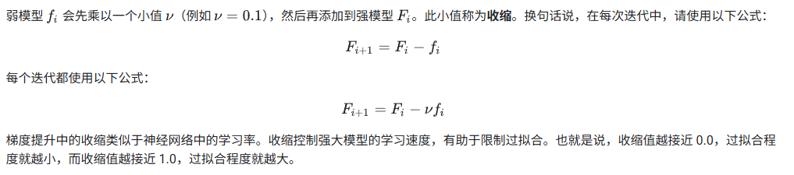

## 梯度提升

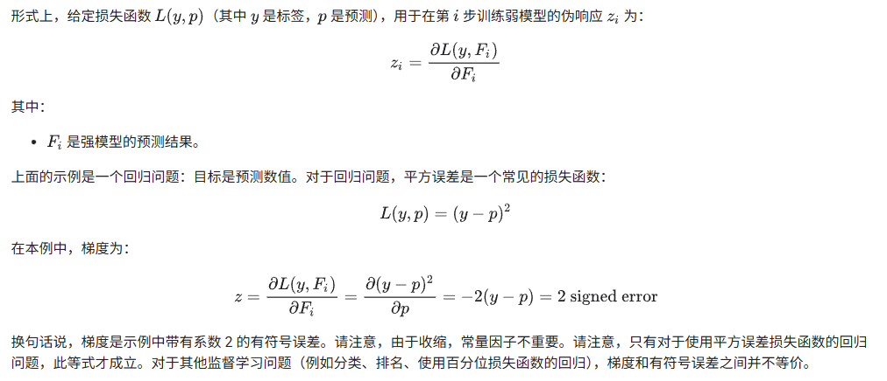

## 过拟合、正则化和早停法

### 过拟合

与随机森林不同，梯度提升树*可能会*过拟合。

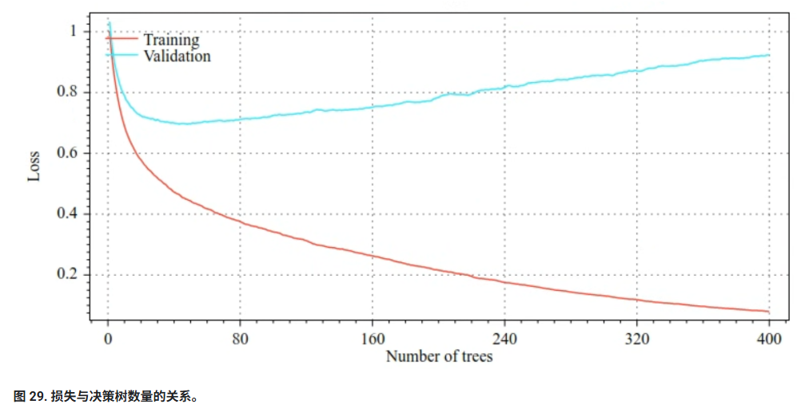

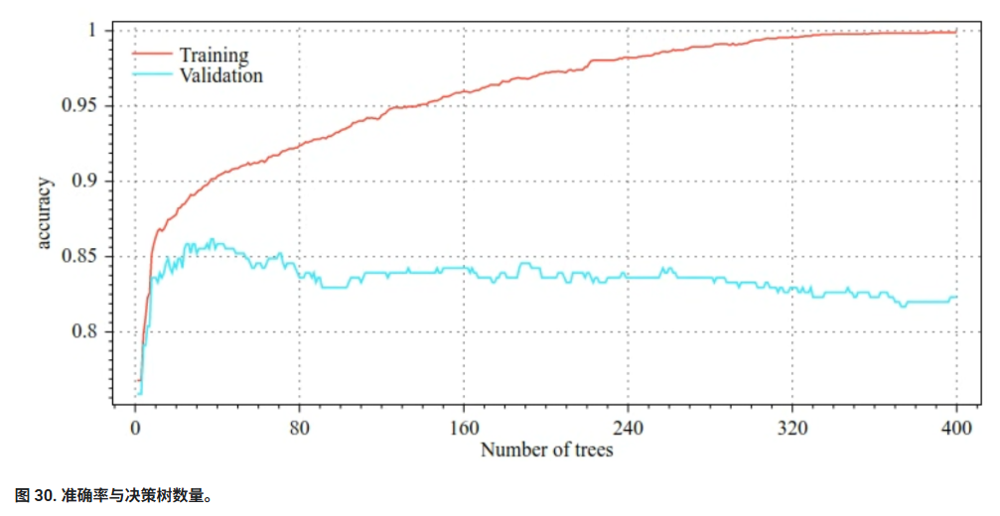

### 正则化

梯度提升树的常见正则化参数包括：

- 树的最大深度。
- 收缩率。
- 每个节点测试的属性的比例。
- 损失函数的 L1 和 L2 系数。

请注意，决策树通常比随机森林模型要浅得多。默认情况下，TF-DF 中的梯度提升树会生长到深度 6。 由于树的深度较浅，因此每个叶子节点的最小示例数影响不大，通常不需要进行调整。

当训练示例数量较少时，需要验证数据集是一个问题。因此，通常是在交叉验证循环中训练梯度提升树，或者在已知模型不会过拟合时停用提前停止。

## 梯度提升树的优缺点

**优点**

- 与决策树一样，它们原生支持数值特征和分类特征，通常不需要特征预处理。
- 梯度提升树具有默认超参数，通常可提供出色的结果。不过，调整这些超参数可以显著改进模型。
- 梯度提升树模型通常体积较小（节点数和内存用量较小），并且运行速度较快（通常只需 1 到 2 微秒即可处理一个示例）。

**缺点**

- 决策树必须按顺序进行训练，这可能会大大减慢训练速度。不过，决策树较小，这在一定程度上抵消了训练速度放慢的影响。
- 与随机森林一样，梯度提升树无法学习和重复使用内部表示法。每个决策树（以及每个决策树的每个分支）都必须重新学习数据集模式。在某些数据集中（尤其是包含非结构化数据 [例如图片、文本] 的数据集），这会导致梯度提升树的结果不如其他方法。


