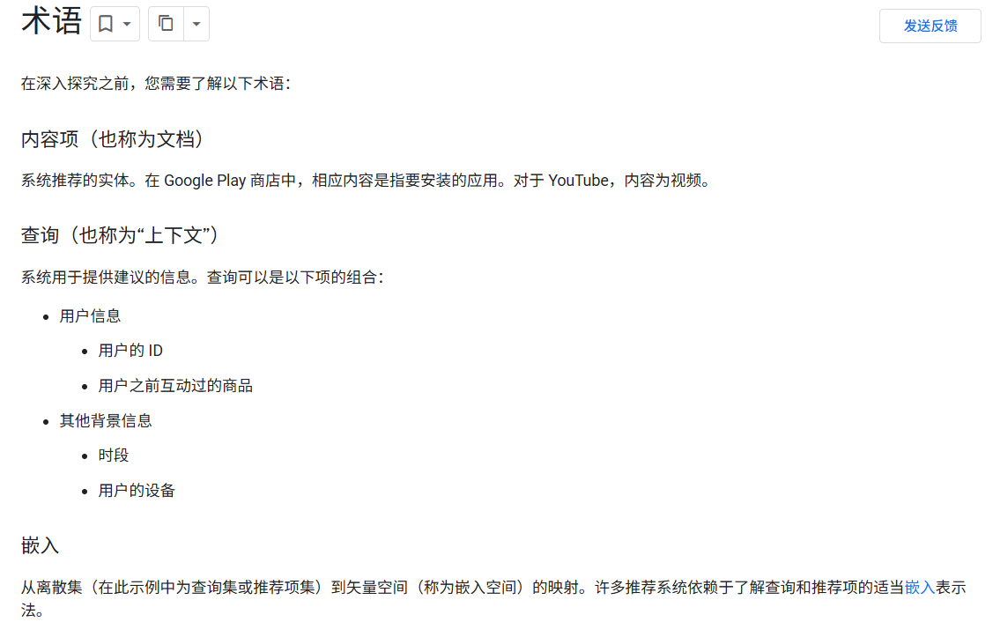
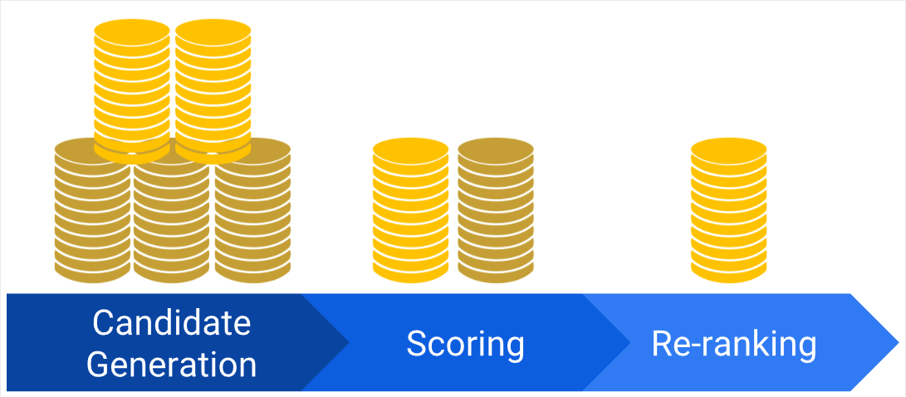
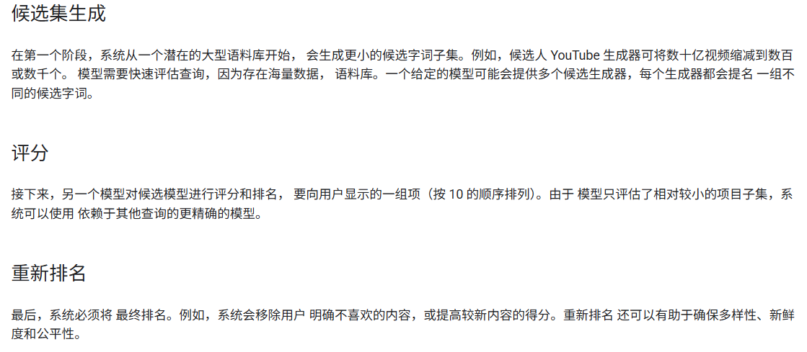
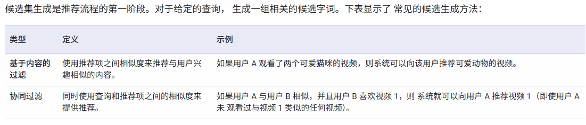
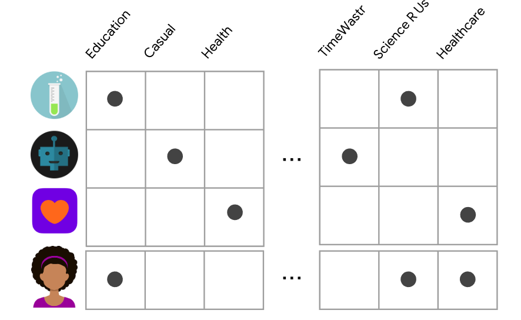

# 术语

# 推荐系统概览

# 候选集的生成

## 基于内容的过滤

**基于内容的过滤（Content-based Filtering）** 是一种推荐系统方法，根据用户的历史偏好或项目的内容特征进行个性化推荐。

**优势：**

- **无需其他用户数据**：推荐是特定于用户的，因此模型不需要其他用户的行为数据，便于扩展到大量用户。
- **捕捉用户兴趣**：能够精准捕捉用户的兴趣，推荐一些**小众物品**，即使这些物品的其他用户兴趣较少。

**缺点：**

- **依赖手工特征**：由于物品的特征需要手动设计，因此需要大量领域知识。模型的效果取决于这些特征的质量。
- **局限于已有兴趣**：模型只能基于用户现有的兴趣进行推荐，扩展用户兴趣的能力有限。

基于内容的推荐系统适用于需要精准匹配用户兴趣的场景，但也存在一定的局限性，特别是在发现用户潜在兴趣方面。

## 协同过滤 

**协同过滤**是通过分析用户与物品之间的交互数据（如评分、点击等）来为用户推荐物品。它不依赖物品的内容特征，而是基于用户行为或物品相似性进行推荐。

- **基于用户的协同过滤：**通过查找与目标用户兴趣相似的其他用户来推荐物品。

- **基于物品的协同过滤：**通过查找与目标物品相似的其他物品来进行推荐。

### **矩阵因式分解模型与公式**

协同过滤的核心是基于用户和物品的**反馈矩阵**，通过**矩阵因式分解**来降低维度并捕捉用户与物品之间的潜在关系。

#### 1. **反馈矩阵 A**

假设有 m 个用户和 n 个物品，反馈矩阵 A 是一个 m×n 的矩阵，其中 $A_{ij}$ 表示用户 i 对物品 j 的反馈（例如评分）。
$$
A = \begin{pmatrix} A_{11} & A_{12} & \cdots & A_{1n} \\ A_{21} & A_{22} & \cdots & A_{2n} \\ \vdots & \vdots & \ddots & \vdots \\ A_{m1} & A_{m2} & \cdots & A_{mn} \end{pmatrix}
$$

#### 2. **矩阵因式分解**

协同过滤通过矩阵因式分解将 A 分解成两个低维矩阵 U 和 V，其中：

- U 是 m×d 的用户嵌入矩阵，表示用户的潜在特征。
- V 是 n×d 的物品嵌入矩阵，表示物品的潜在特征。
- d 是嵌入的维度，通常远小于 m 和 n。

目标是通过点积（点积可以捕捉到相似性）使得矩阵因式分解的结果尽可能接近原始矩阵 A：
$$
A_{ij} \approx U_i \cdot V_j^T
$$
其中：

- $U_i$ 是用户 i 的嵌入向量（一个 d 维向量），
- $V_j$ 是物品 j 的嵌入向量（一个 d 维向量），
- $U_i \cdot V_j^T$ 是用户 i 对物品 j 的预测评分。

------

### 目标函数：最小化误差

训练的目标是最小化预测评分 $\hat{A}_{ij} = U_i \cdot V_j$ 与真实评分 $A_{ij}$ 之间的误差。最常见的目标函数是**平方误差**（MSE）：
$$
\text{Loss} = \sum_{(i,j) \in \text{observed}} (A_{ij} - \hat{A}_{ij})^2
$$
这里，$(i,j)∈observed(i,j) $ 表示我们只对已观察到的条目求和，忽略那些未观察到的条目。

#### **加权矩阵分解**

为了处理未观察条目的问题（例如冷启动问题），我们通常使用加权矩阵分解，其中每个条目 $A_{ij}$ 会乘上一个权重 $w_{ij}$，使得模型可以在优化过程中给予不同条目不同的权重：
$$
\text{Loss} = \sum_{(i,j) \in \text{observed}} w_{ij} \cdot (A_{ij} - U_i \cdot V_j^T)^2
$$
其中 $w_{ij}$ 是一个超参数，用于控制每个条目的权重。例如，频繁的物品可以给予较低的权重，稀有物品则给予较高的权重。

------

### **优化算法**

#### 1. **随机梯度下降法 (SGD)**

- **目标**：通过计算目标函数的梯度来更新用户和物品的嵌入向量 $U_i$ 和 $V_j$。

- **公式**：更新嵌入向量的步骤是通过梯度下降计算：
  $$
  U_i \leftarrow U_i - \eta \frac{\partial \text{Loss}}{\partial U_i}, \quad V_j \leftarrow V_j - \eta \frac{\partial \text{Loss}}{\partial V_j}
  $$
  其中，$\eta$ 是学习率。

#### 2. **加权交替最小二乘法 (WALS)**

- **目标**：通过交替优化 $U_i$ 和 $V_j$ 来最小化损失。每次固定一个矩阵，优化另一个矩阵。

- **过程**：

  - **第一步**：固定物品嵌入矩阵 V，解决用户嵌入矩阵 U 的问题。
  - **第二步**：固定用户嵌入矩阵 U，解决物品嵌入矩阵 V 的问题。

  WALS 通过精确求解线性方程来更新嵌入矩阵，每步都能精确减少损失，因此收敛较快。

------

### 总结

- **协同过滤**依赖于用户和物品之间的交互数据，通过矩阵因式分解来优化用户和物品的嵌入向量，从而进行推荐。
- **目标函数**使用平方误差来衡量预测评分和实际评分之间的差距，训练过程中优化这些嵌入向量。
- 常用的优化算法包括**SGD**（灵活但收敛慢）和**WALS**（收敛快，特别适合矩阵因式分解）。

矩阵因式分解是推荐系统的核心方法之一，能够帮助我们有效地捕捉用户与物品之间的隐式关系。

## 推荐系统中的DNN模型

### Softmax DNN 模型

#### 1. 为什么从矩阵分解走向 DNN

- 传统矩阵分解（MF）的两个主要局限：
  - 难以使用 **侧信息特征**（side features），比如年龄、国家、历史行为等，只能用用户 ID / 物品 ID。
  - 推荐结果容易变成“**人人都推热门**”，很难捕获用户更个性化的兴趣（点积相似度过于简单）。
- DNN 的优势：
  - 输入层可以灵活接收 **稠密特征**（如观看时长、距上次观看时间）和 **稀疏特征**（如观看历史、国家地区等）。
  - 多层非线性变换可以刻画更复杂的用户兴趣模式。

#### 2. Softmax DNN：把推荐问题视作多分类问题

- 任务设定：
  - **输入**：用户查询（query）特征向量，记为 $x$。
  - **输出**：一个长度为物品总数 $n$ 的 **概率向量** $\hat p \in \mathbb{R}^n$，第 i 维是“该用户会与第 i 个物品交互（点击/观看）的概率”。

#### 3. 输入层：特征向量 $x$

- 输入可以由多种特征拼接得到：
  - 稠密特征。
  - 稀疏特征。
- 与矩阵分解不同，这里可以自然地加入各种 **side features**，将其编码后并入 $x$。

#### 4. 模型结构：隐藏层与查询嵌入 $\psi(x)$

- 若干全连接层 + 非线性激活（如 ReLU），将输入 $x$ 映射到一个 d 维向量：

$$
\psi(x) \in \mathbb{R}^d
$$

- $\psi(x)$ 可以理解为 **query 的嵌入表示（embedding）**，类似矩阵分解中的 “用户向量”，但它是 **由特征通过非线性函数算出来的**，而不是为每个用户单独存一个向量。

#### 5. Softmax 输出：从得分到概率分布

1. 先用一个参数矩阵

$$
V \in \mathbb{R}^{n \times d}
$$

​	将 $\psi(x)$ 映射到长度为 n 的得分向量（logits）：
$$
y = \psi(x) V^\top \in \mathbb{R}^n
$$

2. 再通过 softmax 函数 $h(\cdot)$ 得到预测概率分布：

$$
\hat p = h(y), \quad h(y)_i = \frac{e^{y_i}}{\sum_j e^{y_j}}
$$

- softmax 是“**软最大**”：
  - “硬最大”会给得分最高的项概率 1，其余为 0；
  - softmax 对所有项给非零概率，但得分高的概率更大；

#### 6. 损失函数：比较两种概率分布

- 模型输出：
  - $\hat p$：softmax 输出的预测概率分布。
- 真实标注：
  - $p$：用户实际交互过的物品分布——可以用 **归一化的 multi-hot 向量** 表示（一个 session 内可能点了多个物品）。
- 常用损失：**交叉熵损失**，因为要比较两个概率分布 $p$ 和 $\hat p$ 。

#### 7. Softmax Embeddings：query / item 嵌入的统一视角

- 对某个物品 j，其预测概率为：

$$
\hat p_j = \frac{\exp(\langle \psi(x), V_j \rangle)}{Z}
$$

​	其中$V_j \in \mathbb{R}^d$ 是矩阵 V 的第 j 行，Z 是归一化常数。

- 取对数可得：

$$
log(\hat p_j) = \langle \psi(x), V_j \rangle - \log Z
$$

- 这带来两个关键解释：
  - $\psi(x)$ 是 **query 的嵌入向量**；
  - $V_j$ 是 **第 j 个物品的嵌入向量**；
  - 因为 $\log$ 是单调递增函数，**概率最大的物品就是点积 $\langle \psi(x), V_j \rangle$ 最大的物品**，点积可以视为嵌入空间里的相似度。

#### 8. Softmax DNN 与矩阵分解的关系

- 在矩阵分解模型中：
  - 每个物品有一个 embedding $V_j$；
  - 每个用户（或 query）有一个 embedding $U_i$。
- 在 Softmax DNN 中：
  - 仍然对每个物品学习一个 embedding $V_j$，矩阵 $V \in \mathbb{R}^{n \times d}$ 实际就对应 MF 中的物品矩阵；
  - **query 侧不再是单独的向量 $U_i$，而是一个映射 $\psi(\cdot)$，将特征 $x$ 映射到嵌入 $\psi(x)$。**
- 因此可以把 Softmax DNN 看作 **矩阵分解的泛化版本**：
  - 物品侧保持“一个物品一个向量”；
  - query 侧由“查表式向量”升级为“特征 → 嵌入”的非线性函数 $\psi(x)$。

### Softmax DNN 的训练数据、折叠问题与负采样

#### 1. 训练数据的形式

- Softmax DNN 的一条训练样本由两部分组成：
  - **查询特征向量** $x$；
  - **用户交互过的物品分布** $p \in \mathbb{R}^n$，是一个概率向量（通常由 multi-hot 归一化得到）。
- 模型的参数包括：
  - 各层的权重（隐藏层 + softmax 层矩阵 V 等）；
  - 训练常用 **随机梯度下降（SGD）** 或其变体。
- 损失函数比较的是两个长度为 n 的向量 $p$ 与 $\hat p(x)$，通常用交叉熵。

当物品数 n 很大时，对每条样本完全计算梯度的代价非常高（需要对所有 n 个类求梯度）。

#### 2. 折叠（collapse）现象

- 一个“节省计算”的直觉做法：
  - 只对 $p$ 中为正（非零）的维度计算梯度（即**正样本项**），忽略所有负项。
- 问题：这么做会导致模型容易出现 **折叠（collapse）**：
  - 想象嵌入空间里有多个“颜色簇”——每个簇代表一种“query–item 类别”（例如不同语言、不同兴趣群体）；
  - 训练时如果只告诉模型：“对每个 query，要把它推向自己颜色簇里的 item”，而从不强调“要远离其他颜色的 item”，
     就有可能出现：
    - 同一簇内部的相对结构学对了；
    - 但**不同簇之间逐渐靠得很近甚至堆到一起**，整个空间“折叠”成一个大团。
  - 结果是：
    - 在线推荐时，模型可能会给“属于错误簇的 item”打很高的分数——看上去很像，但其实并不属于这个用户的兴趣群体。
- 根本原因：
  - 没有给模型足够的“**负反馈**”，告诉它“这些 item 对这个 query 是不相关的，需要推开”。

#### 3. 负采样（Negative Sampling）

为了在大规模语料库下兼顾计算效率和训练质量，可以采用 **负采样** 来构造一个 **近似梯度**：

- 对每个训练 query $x$，在计算损失梯度时只保留：
  1. **所有正项**（即 $p$ 中非零的维度，对应用户真正交互过的物品）；
  2. **一小部分负项**，从其余物品中采样得到。

这样：

- 不用对所有 n 个物品求梯度，计算量大幅下降；
- 又不会像“只用正项”那样完全缺失负反馈，可以在一定程度上避免折叠。

