# 聚类类型

## 基于质心的聚类

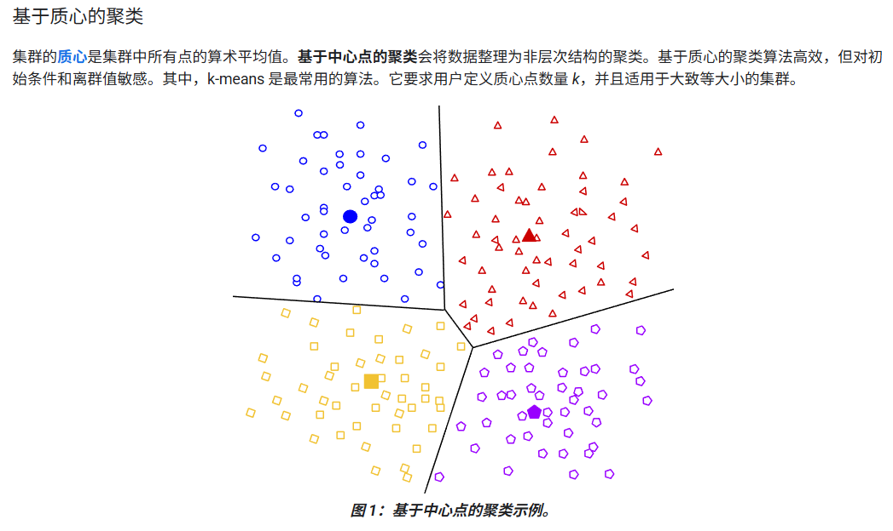

## 基于密度的聚类

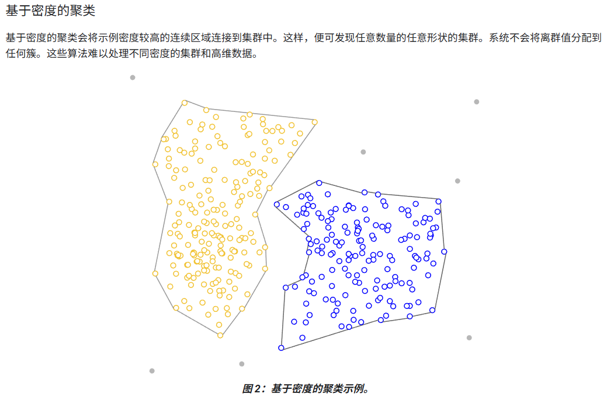

## 基于分布的聚类

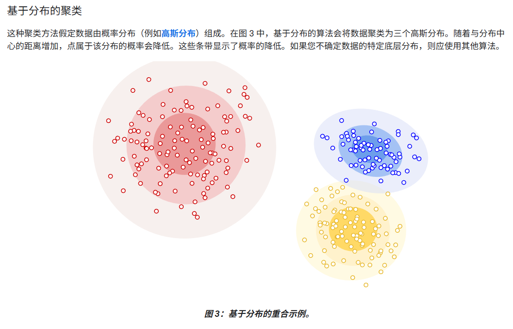

## 层次聚类

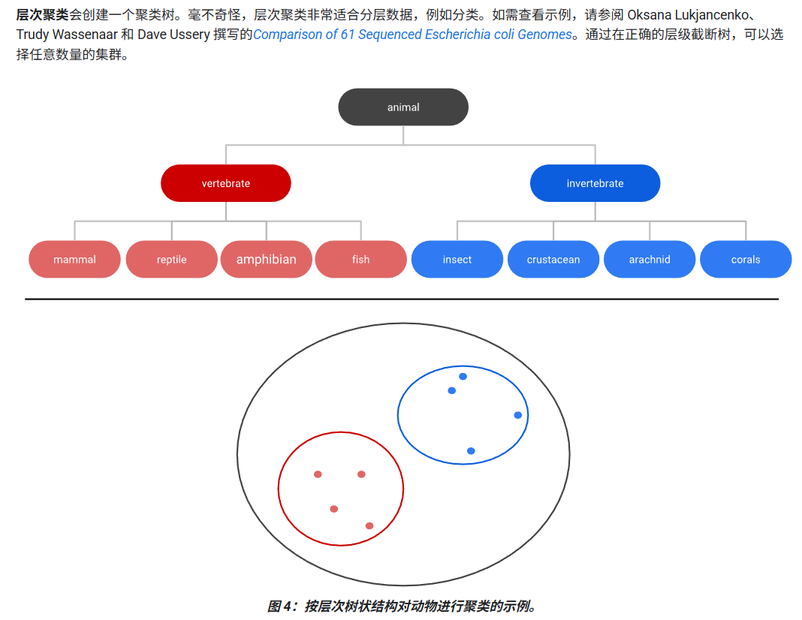

# 聚类工作流

1. **准备数据**：对特征进行清洗、归一化、缩放或必要的转换，确保数据能够支持后续的相似度计算。
2. **创建相似度指标**：根据数据特点设计合理的相似度或距离度量，使模型能够准确衡量样本间的相似程度。
3. **运行聚类算法**：选择并执行聚类算法（如 k-means 等），根据相似度指标将数据自动分组。
4. **解读结果并调整聚类**：分析聚类效果，在簇级和样本级检查结果是否合理，如不理想则返回前面步骤继续调整与迭代。

# 聚类数据的处理

## 数据需要预处理的原因

在聚类时，往往要将两个样本的所有特征数据组合为一个数值来反映二者之间的相似度。这要求**不同的特征需要具有相同的尺度**，所以需要对数据进行归一化、对数转换或分箱。

## 数据归一化   Z分数

## 对数转换

## 分位数分箱

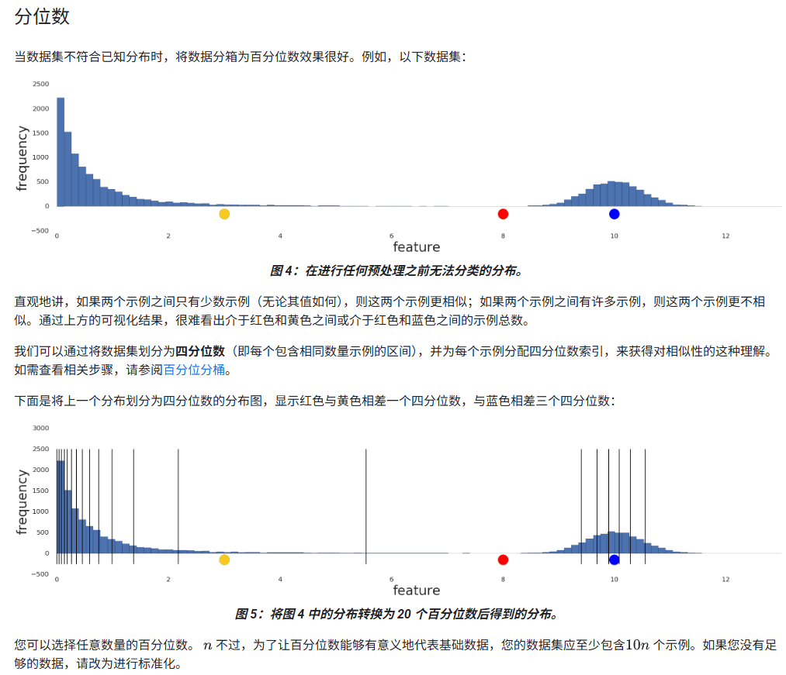

# k-means 聚类

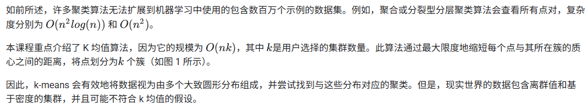

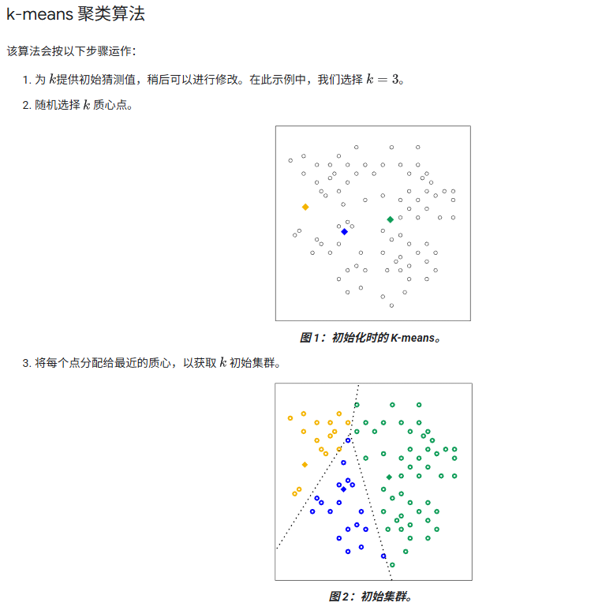

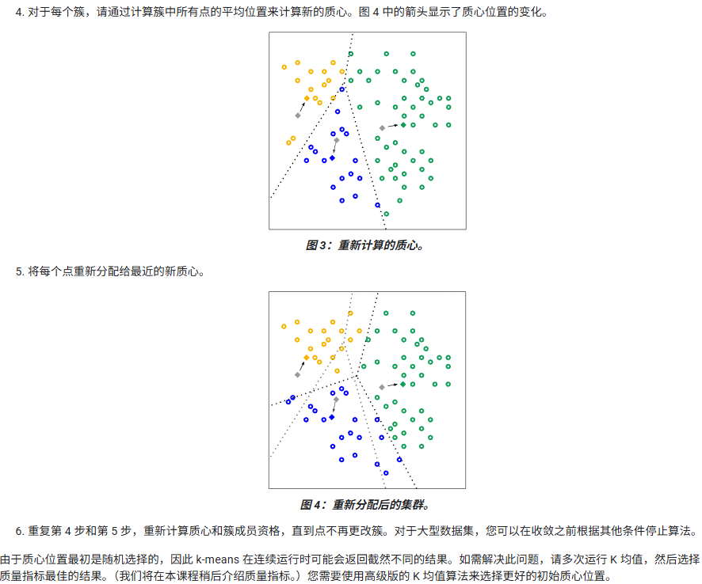

# 手动相似度衡量

## **1. 数值特征的数据准备**

为了让不同数值特征“可比较”，需要进行：

- **归一化 / 标准化**（如 z-score）
- 或 **基于百分位（四分位/百分位）缩放**

示例：鞋码 + 价格

- 先将两个特征缩放到相同范围（如 0–1）
- 再用欧几里得距离或 RMSE 合并成一个距离值

> 数值越相似 → 距离越小。
> 为了得到“相似度”（直观上，越相似，该指标越大），可使用：

$$
\text{similarity} = 1 - \text{RMSE}
$$

------

## **2. 分类特征的处理**

分类特征比数值难处理，分两种情况：

### **2.1 单值分类（single-valued）**

例如：

- 颜色：红 / 蓝 / 白
- 性别
- 品牌类型

相似性定义简单：

- 一样 → 1
- 不一样 → 0

### **2.2 多值分类（multi-valued）**

例如：

- 电影类型："action","comedy"
- 用户兴趣标签："travel","music","food"

相似度 → **Jaccard 相似度**（交集元素数量/并集元素数量）
$$
\mathrm{Jaccard}(A,B)=\frac{|A\cap B|}{|A\cup B|}
$$
示例：

- "comedy","action, comedy" → 1/2
- 完全一样 → 1
- 无重叠 → 0

Jaccard 提供一个合理的“部分相似”度量。

------

## **3. 特殊分类数据的处理方法**

有些“看似分类”的数据，实际上可以映射到更合适的空间：

- **邮政编码 → 经纬度 → 欧氏距离**
- **颜色 → RGB 数值 → 欧氏距离**

这比简单的“相同=1，不同=0”更能反映真实语义。

------

## **4. 手动相似度衡量的原则**

设计手动相似度衡量时必须保证：

1. **相似的样本 → 高相似度 / 低距离值**
2. **不相似的样本 → 低相似度 / 高距离值**
3. 衡量方法必须能反映你真正想捕捉的关系
4. 数据必须经过恰当的预处理（规范化、编码）

如果不满足以上要求，则说明你的相似度指标没有正确编码数据意义。

------

## **5. 手动创建相似度的局限性**

随着数据变得更复杂（混合特征、多维结构、复杂标签），手动构造相似度越来越困难。

→ **解决方案：使用监督式相似度学习**
 （例如：深度 metric learning、Siamese networks，我们将在后续部分学习）

# 评估聚类结果

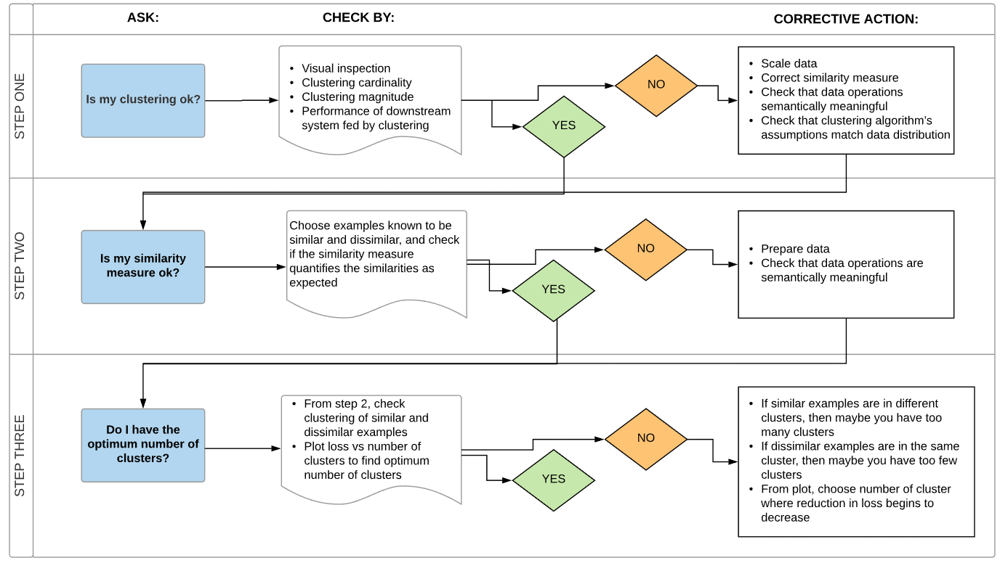

## 第 1 步：评估聚类质量

### **1. 簇基数（Cluster Cardinality）**

- 含义：每个簇中的样本数量
- 用途：识别“异常的小簇或大簇”
- 异常含义：
  - 小簇 → 可能是噪声点或 k 太大
  - 大簇 → 可能把不相似样本混在一起

------

### **2. 簇大小（Cluster Size / Magnitude）**

- 含义：簇内所有样本到簇中心点距离的总和
- 用途：判断簇是否“过于松散”
- 异常含义：
  - 尺度特别大 → 该簇内部结构混乱、不像一个簇
  - 可以配合最大距离、平均距离进一步分析

------

### **3. 基数–大小关系（Cardinality vs Size Relationship）**

- 含义：检查「簇基数越大 → 簇大小越大」的正常线性趋势
- 用途：在散点图中找出**偏离这条趋势线的异常簇**
- 异常含义：
  - 基数不大但大小巨大 → 簇很散，不合理
  - 基数很大但大小很小 → 簇过度合并

------

### **4. 下游性能（Downstream Performance）**

- 含义：聚类结果用于下一步任务（推荐、分类、检索）时，性能是否改善
- 用途：从**业务角度**评估聚类是否有价值
- 异常含义：
  - 聚类变化导致性能下降 → 相似度或簇数需要重新审查

## 第 2 步：重新评估您的相似度度量

聚类算法的效果取决于相似度衡量方法。确保您的相似度衡量方法会返回合理的结果。快速检查的方法是找出已知大致相似的示例对。计算每对示例的相似度衡量值，并将结果与您的知识进行比较：相似示例对的相似度衡量值应高于不相似示例对的相似度衡量值。

您用于抽查相似度衡量标准的示例应能代表数据集，以便您能够确信相似度衡量标准适用于所有示例。无论是手动还是监督方法，相似度衡量指标的性能在整个数据集中都必须保持一致。如果某些示例的类似度衡量标准不一致，则这些示例不会与类似示例进行重合。

## 第 3 步：确定最佳簇数 肘部法

### **1. 为什么要选 K？**

K-means 必须事先指定簇数 KKK。
K 太小 → 分类过粗；
K 太大 → 过拟合、簇太散且复杂度高。

------

### **2. 基本方法：用不同的 K 多次运行 k-means**

对一系列 K（例如 2~20）：

1. 运行 k-means

2. 计算每个 K 的**簇内距离总和**（所有样本到对应质心距离之和）

   - 又称 Loss 或 WCSS（Within-Cluster Sum of Squares）

   $$
   \text{Loss}(K)
   = \sum_{k=1}^{K} \; \sum_{x_i \in \text{簇 } k} \text{dist}(x_i, \mu_k)
   $$

这个 Loss 会随着 K 增大而降低：

- K 小时：每新增一个簇都能显著降低误差
- K 大到一定程度后：继续增 K 的收益变得很小

------

### **3. 肘部法（Elbow Method）**

画出图：

- 横轴：簇数 K
- 纵轴：Loss(K)

曲线通常呈“快速下降 → 变平”的形状。

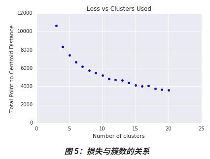

**最佳 K = 曲线斜率首次明显变缓的位置**
这类似手臂的“肘部”，因此称为肘部法。

图示特点：

- 肘部之前：增加 K 明显降低损失
- 肘部之后：继续增加 K 收益微小，曲线趋于平缓

示例：若图中约在 K=11 出现显著拐点，则 11 是推荐的簇数。

------

### **4. 更细的聚类**

如果希望更精细的划分，可以在肘部附近稍微取更大的 K（如 12、13）。

# K-means的优缺点

## 优点

- **实现起来相对容易。**
- **可扩展到大型数据集。**
- **始终收敛。**
- **允许对重心位置进行热启动。**
- **能够顺畅地适应新示例。**
- **可推广到不同形状和大小的集群，例如椭圆形集群。**

## 缺点

-  **k 必须手动选择。**
- **结果取决于初始值。**
- **难以对大小和密度各异的数据进行聚类，且无法进行泛化。**
- **难以对离群值进行按预期的方式的处理。**
- **难度会随着维度数量而扩展。**

## 推广的K-means

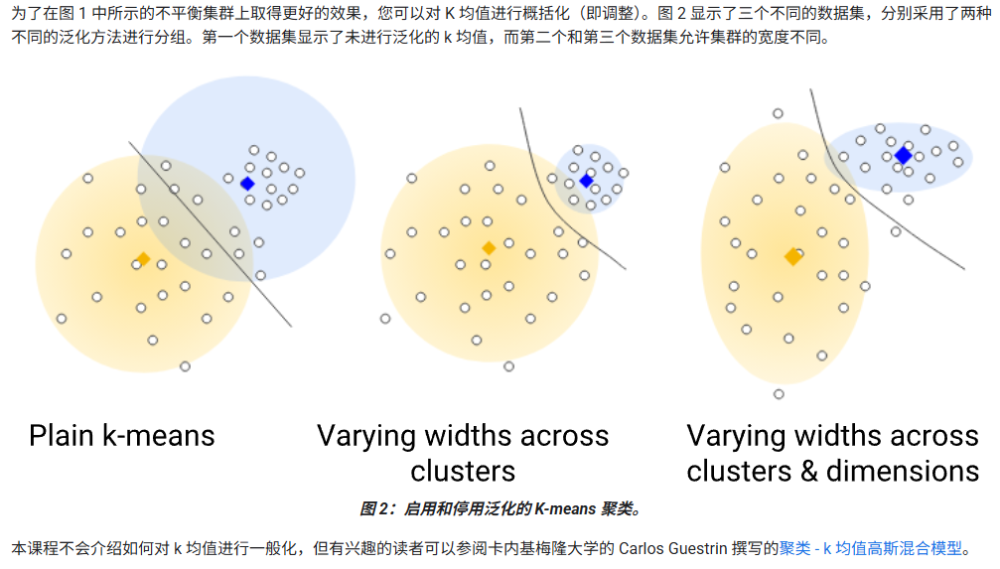

## 维度诅咒和谱聚类

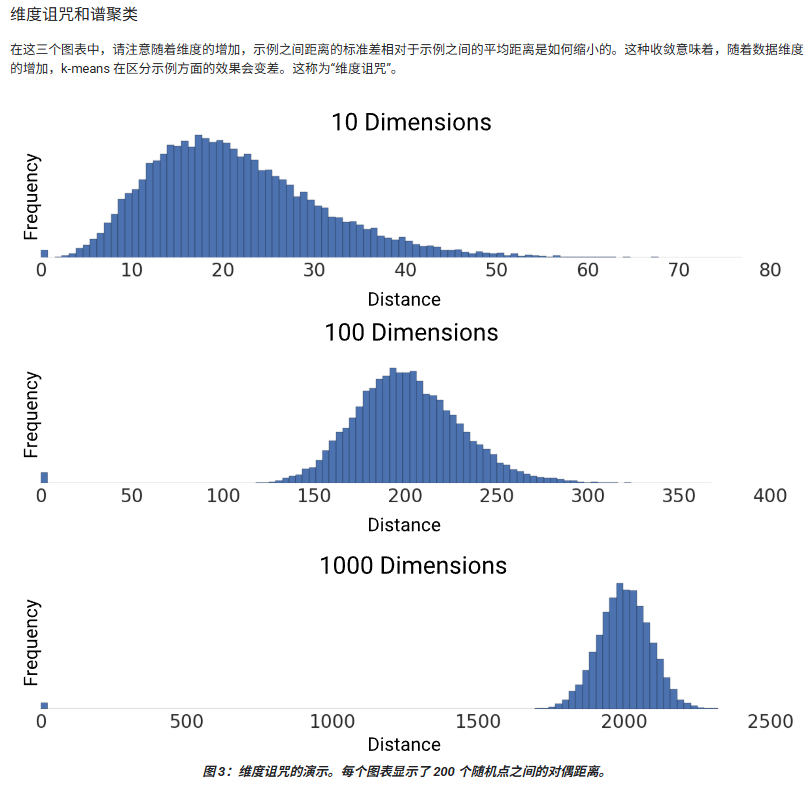

可以使用**谱聚类**来避免这种性能下降，该方法会向算法添加预聚类步骤。如需执行谱聚类，请执行以下操作：

1. 使用 PCA 来降低特征数据的维度。
2. 将所有数据点投影到较低维的子空间。
3. 使用您选择的算法对此子空间中的数据进行聚类。

# 自动编码器、预测期和嵌入

嵌入是通过对特征数据本身训练监督式**深度神经网络** (**DNN**) 生成的。嵌入会将特征数据映射到嵌入空间中的向量，该向量的维度通常比特征数据少。**监督式相似度衡量**使用这种“接近度”来量化一对示例的相似度。

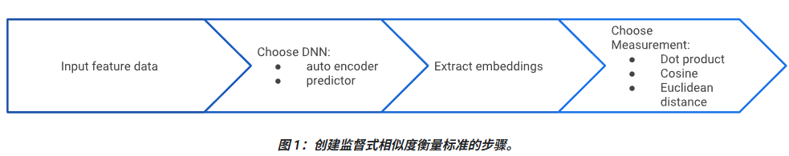

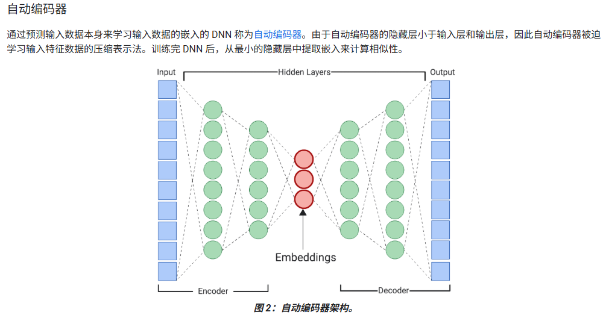

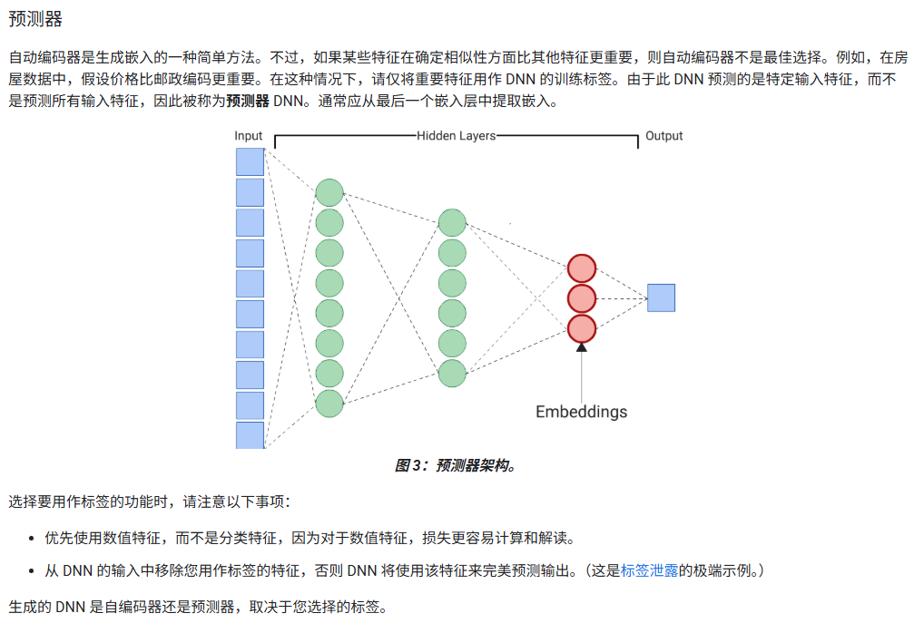

# 衡量嵌入的相似度

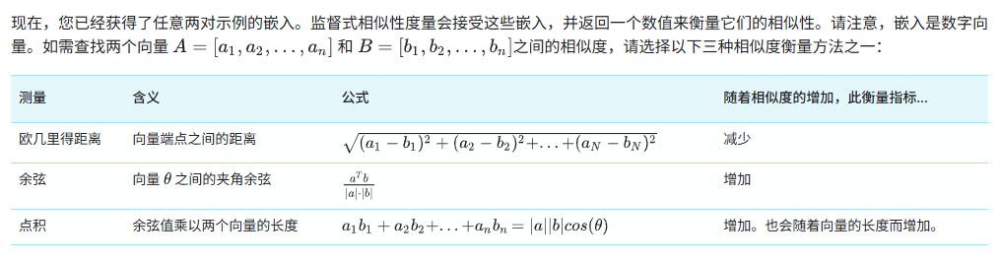

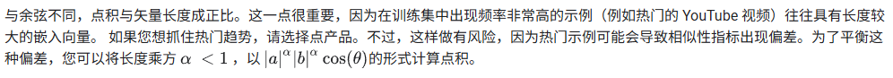

